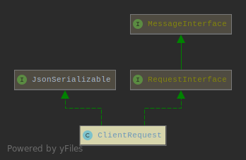
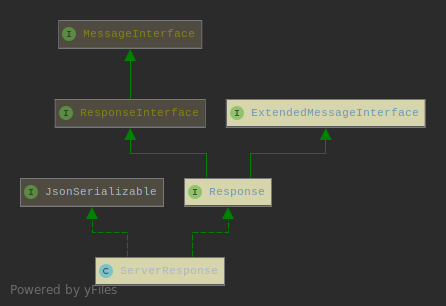

Koded - HTTP Library
====================

[](https://packagist.org/packages/koded/http)
[](https://travis-ci.org/kodedphp/http)
[](https://www.codacy.com/app/kodeart/http)
[](https://www.codacy.com/app/kodeart/http)
[](https://packagist.org/packages/koded/http)
[](https://php.net/)
[](LICENSE)


Koded HTTP library implements PSR-7 (HTTP message).

To provide you with more useful methods, the request and response instances
are extended with [additional interfaces](#interfaces) that you may use in your projects.


ServerRequest
-------------

```php
class ServerRequest extends ClientRequest implements Request {}
```

This object represents the incoming server-side HTTP request.


ClientRequest
-------------

```php
class ClientRequest implements RequestInterface, JsonSerializable {}
```

This object is a representation of an outgoing client-side HTTP request.




ServerResponse
--------------

```php
class ServerResponse implements Response, JsonSerializable {}
```

This object represents the outgoing server-side response.




UploadedFile
------------

This value object represents a file uploaded through an HTTP request.


Factories
---------

```php
$clientRequest = (new RequestFactory)->createRequest('GET', '/');
$serverRequest = (new ServerRequestFactory)->createServerRequest('GET', '/');

$response = (new ResponseFactory)->createResponse(201);

$stream = (new StreamFactory)->createStream('Hello there');
$stream = (new StreamFactory)->createStreamFromFile('file.name', '+w');
$stream = (new StreamFactory)->createStreamFromResource($resource);

$url = (new UriFactory)->createUri('/');

$uploadFile = (new UploadedFileFactory)->createUploadedFile($stream);
```

HTTP clients
============

There are 2 implementations for `ClientRequest` interface
- PHP
- curl

To create instances of HTTP clients, use the `Koded\Http\Client\ClientFactory` class

```php
<?php

use Koded\Http\Client\ClientFactory;

$http = new ClientFactory(ClientFactory::CURL); // or ClientFactory::PHP

$http->get('/', $headers);
$http->post('/', $body, $headers);
$http->put('/', $body, $headers);
$http->patch('/', $body, $headers);
$http->delete('/', $headers);
$http->head('/', $headers);
```

`$headers` are optional.


Additional interfaces
=====================


- `Koded\Http\Request`
- `Koded\Http\Response`

These two may be useful in your project as they provide additional 
methods to manipulate the request/response objects state.

### Request
- `getPath(): string`
- `getBaseUri(): string`
- `withAttributes(array $attributes): Request`
- `isSecure(): bool`
- `isSafeMethod(): bool`
- `isXHR(): bool`

### Response
- `getContentType(): string`


HttpInputValidator
------------------
// TODO

Other interfaces in this package are mostly for internal use.


License
-------

The code is distributed under the terms of [The 3-Clause BSD license](LICENSE).
