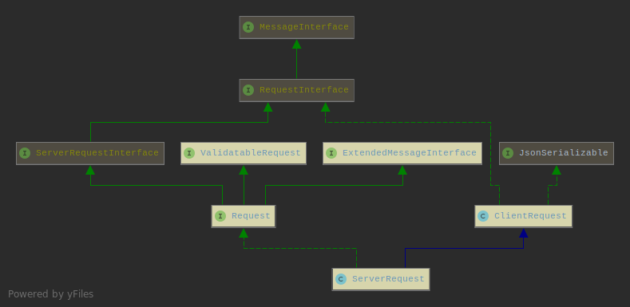
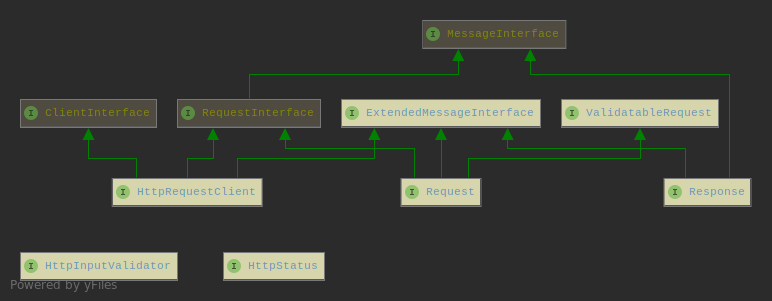

Koded - HTTP Library
====================

[](https://packagist.org/packages/koded/http)
[](https://travis-ci.org/kodedphp/http)
[](https://scrutinizer-ci.com/g/kodedphp/http/?branch=master)
[](https://scrutinizer-ci.com/g/kodedphp/http/?branch=master)
[](https://packagist.org/packages/koded/http)
[](https://php.net/)
[](LICENSE)


Koded HTTP library implements [PSR-7][1] (HTTP message), [PSR-17][2] (HTTP Factories) and [PSR-18][3] (HTTP Client).

To have more useful everyday methods for your projects, the request and response instances
are extended with [additional interfaces](#additional-interfaces).


ServerRequest
-------------

```php
class ServerRequest extends ClientRequest implements Request {}
```

This object represents the **incoming server-side** HTTP request.




ClientRequest
-------------

```php
class ClientRequest implements RequestInterface, JsonSerializable {}
```

This object is a representation of an **outgoing client-side** HTTP request.


ServerResponse
--------------

```php
class ServerResponse implements Response, JsonSerializable {}
```

This object represents the **outgoing server-side** response.


UploadedFile
------------

This value object represents a file uploaded through the HTTP request.


HTTP Factory
------------

Implementation of [PSR-17][2] (HTTP Factories).

```php
<?php

use Koded\Http\HttpFactory;

$httpFactory = new HttpFactory;

$clientRequest = $httpFactory->createRequest('GET', '/');
$serverRequest = $httpFactory->createServerRequest('GET', '/');

$response = $httpFactory->createResponse(201);

$stream = $httpFactory->createStream('Hello there');
$stream = $httpFactory->createStreamFromFile('file.name', '+w');
$stream = $httpFactory->createStreamFromResource($resource);

$uri = $httpFactory->createUri('/');

$uploadedFile = $httpFactory->createUploadedFile($stream);
```

HTTP clients
============

There are 2 implementations for `ClientRequest` interface
- PHP stream
- curl

To create instances of HTTP clients, use the `Koded\Http\Client\ClientFactory` class

```php
<?php

use Koded\Http\Client\ClientFactory;

$http = new ClientFactory(ClientFactory::CURL); // or ClientFactory::PHP

$http->get('/', $headers);
$http->post('/', $body, $headers);
$http->put('/', $body, $headers);
$http->patch('/', $body, $headers);
$http->delete('/', $headers);
$http->head('/', $headers);
```

`$headers` are optional.

HTTP Client (PSR-18)
--------------------

Implementation of [PSR-18][3] (HTTP Client).

```php
<?php

use Koded\Http\Client\ClientFactory;
use Koded\Http\ClientRequest;

$request = new ClientRequest('POST', 'https://...', ['foo' => 'bar']);
$response = (new ClientFactory)->sendRequest($request);
```

Additional interfaces
=====================


- `Koded\Http\Request`
- `Koded\Http\Response`

These two may be useful in your project as they provide additional 
methods for request/response objects state.

### Request
- `getPath(): string`
- `getBaseUri(): string`
- `withAttributes(array $attributes): Request`
- `isSecure(): bool`
- `isSafeMethod(): bool`
- `isXHR(): bool`

### Response
- `getContentType(): string`

ExtendedMessageInterface
------------------------

Both `Request` and `Response` extends this interface, thus providing the extra methods:
- `withHeaders(array $headers): static`
- `replaceHeaders(array $headers): static`
- `getFlattenedHeaders(): array`
- `getCanonicalizedHeaders(array $names = []): string`

HttpInputValidator
------------------

The idea here is to have a basic mechanism for validating the incoming request data.
Validation is done in an instance of `HttpInputValidator` object by calling the 
`Request::validate(HttpInputValidator $validator)` method.

`HttpInputValidator::validate()` should return `array`, in case of
- empty array, the validation went fine
- a hash (`['key' => 'value', ...]`), with information what went wrong if incoming data is not valid

The error handling is done in the application. A naive example:

```php
class FormValidator implements HttpInputValidator {

    public function validate(Data $input): array {
        if (empty($input->get('username'))) {
            return ['message' => 'Username is required'];
        }
       return []; 
    }
}

// Somewhere in your app, use the `Request` object to run validation

if ($response = $request->validate(new FormValidator)) {
    // {"message":"Username is required","status":400}
    return $response;
}
```

The error response will always have a status code set (`status` value) in the error message.  
If the status code is not provided in the validation, the default is `400 Bad Request`.


License
-------

The code is distributed under the terms of [The 3-Clause BSD license](LICENSE).


[1]: https://www.php-fig.org/psr/psr-7/
[2]: https://www.php-fig.org/psr/psr-17/
[3]: https://www.php-fig.org/psr/psr-18/
